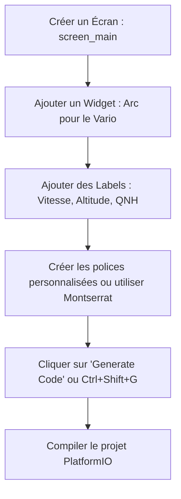

# Guide de configuration d'EEZ Studio avec LVGL pour L!M Vario

Ce guide explique comment configurer **EEZ Studio** de A à Z pour concevoir l'interface graphique de votre vario, l'intégrer avec **LVGL** et **TFT_eSPI** sous PlatformIO, et gérer les contrôles via l'encodeur rotatif du **L!M Vario**.

---

## 1. Pourquoi utiliser EEZ Studio + LVGL ?

Actuellement, l'interface graphique du vario est gérée manuellement en dessinant des polygones et des chaînes de caractères directement sur des sprites `TFT_eSPI` (lignes 217-506 de `main.ino`). Bien que performante, cette approche est fastidieuse dès que l'on souhaite :
- Créer des menus de réglages interactifs complexes (QNH, ballast, volume, etc.).
- Ajouter des animations fluides.
- Utiliser des designs modernes avec des polices de caractères lisses (anti-crénelées).
- Structurer le code en séparant le design (UI) de la logique métier (calculs de vario, décodage NMEA).

**EEZ Studio** agit comme un éditeur WYSIWYG (visuel). Vous concevez vos écrans, vos boutons et vos jauges par glisser-déposer, puis l'outil génère un code C/C++ ultra-optimisé compatible avec la bibliothèque graphique **LVGL** (Light and Versatile Graphics Library).

---

## 2. Étape 1 : Installation d'EEZ Studio

1. Téléchargez la dernière version d'**EEZ Studio** pour Windows sur le site officiel :  
   [https://www.envox.hr/eez/eez-studio/introduction.html](https://www.envox.hr/eez/eez-studio/introduction.html) ou directement depuis leur dépôt GitHub.
2. Installez et lancez l'application.

---

## 3. Étape 2 : Création et paramétrage du projet

Au démarrage d'EEZ Studio :
1. Cliquez sur **New Project**.
2. Sélectionnez le template **LVGL** (n'utilisez pas *EEZ Flow* pour ce projet afin de conserver un code minimaliste et performant).
3. Remplissez les paramètres de base :
   - **Project Name** : `LM_Vario_UI`
   - **LVGL Version** : Sélectionnez **8.3** (fortement conseillé pour l'ESP32 sous Arduino car c'est la version la plus stable et largement documentée).
   - **Display Width** : `240`
   - **Display Height** : `320` (votre écran ILI9341 fonctionne en 240x320 portrait).
   - **Color Depth** : `16-bit` (RGB565).

### Configuration des paramètres d'exportation (Critique !)
Pour que le code généré s'intègre directement dans votre structure PlatformIO sans erreur de compilation :
1. Cliquez sur l'icône **Settings** (roue crantée en bas de la barre latérale gauche).
2. Allez dans l'onglet **Target** (ou *Build* selon les versions).
3. **Output path** : Spécifiez le dossier de destination du code généré dans votre projet. Par exemple :  
   `C:\Users\loyer\Nextcloud\Data\13-Projet Perso\L!M Vario\src\FreeVarioGauge\ui` (EEZ Studio créera ce dossier s'il n'existe pas).
4. **LVGL Include** : Par défaut, EEZ Studio génère `#include "lvgl/lvgl.h"`. Sous PlatformIO avec les bibliothèques Arduino standard, remplacez cette valeur par :
   ```
   lvgl.h
   ```
   *Note : Cela évitera les erreurs d'inclusion de fichier lors de la compilation.*
5. Cochez l'option de génération automatique si vous le souhaitez et sauvegardez les paramètres.

---

## 4. Étape 3 : Configuration de PlatformIO (`platformio.ini`)

Pour faire tourner LVGL sur l'ESP32, ajoutez la dépendance `lvgl` à votre fichier `platformio.ini`.

Modifiez la section `lib_deps` de votre `platformio.ini` comme suit :

```ini
lib_deps =
  bodmer/TFT_eSPI @ ^2.5.31
  mikalhart/Streaming @ ^1.0.0
  madhephaestus/ESP32Encoder @ ^0.10.2
  lvgl/lvgl @ ^8.3.11
```

---

## 5. Étape 4 : Configuration de LVGL (`lv_conf.h`)

LVGL nécessite un fichier de configuration nommé `lv_conf.h` pour activer ou désactiver ses fonctionnalités.

1. Allez dans le répertoire `.pio/libdeps/esp32dev/lvgl` (après avoir lancé une première compilation pour télécharger la bibliothèque) et cherchez le fichier `lv_conf_template.h`.
2. Copiez ce fichier et collez-le directement dans votre dossier de sources sous le nom `src/FreeVarioGauge/lv_conf.h` (ou dans `src/` globalement pour qu'il soit visible).
3. Ouvrez `lv_conf.h` et effectuez les modifications suivantes :
   - À la ligne ~15, changez `#if 0` en :
     ```c
     #if 1
     ```
   - Définissez la profondeur de couleur (ligne ~30) :
     ```c
     #define LV_COLOR_DEPTH 16
     ```
   - Allouez de la mémoire pour LVGL (ligne ~50). Pour un ESP32, 32 Ko à 48 Ko suffisent amplement :
     ```c
     #define LV_MEM_SIZE (32U * 1024U)
     ```
   - Activez le moteur de polices de caractères si vous souhaitez utiliser les polices standard de LVGL (ex: Montserrat) :
     ```c
     #define LV_FONT_MONTSERRAT_14 1
     #define LV_FONT_MONTSERRAT_20 1
     ```

---

## 6. Étape 5 : Initialisation et Liaison de LVGL avec TFT_eSPI

Il faut expliquer à LVGL comment dessiner sur votre écran physique géré par `TFT_eSPI`. Vous devez configurer un double buffer et un callback de rafraîchissement d'écran.

Voici le squelette de code à intégrer dans votre fichier principal `main.ino` :

```cpp
#include <lvgl.h>
#include <TFT_eSPI.h>
#include "ui/ui.h" // Fichiers générés par EEZ Studio

// Déclaration de l'écran TFT (déjà présent dans votre main.ino)
// static TFT_eSPI tft = TFT_eSPI(); // Déjà défini à la ligne 53

// Définition des buffers de rendu pour LVGL
#define MY_DISP_HOR_RES 240
#define MY_DISP_VER_RES 320

static lv_disp_draw_buf_t draw_buf;
// Un buffer de 10 lignes suffit pour économiser la RAM de l'ESP32
static lv_color_t buf[MY_DISP_HOR_RES * 10]; 

/* Fonction de callback appelée par LVGL pour dessiner sur l'écran */
void my_disp_flush(lv_disp_drv_t *disp_drv, const lv_area_t *area, lv_color_t *color_p) {
    uint32_t w = (area->x2 - area->x1 + 1);
    uint32_t h = (area->y2 - area->y1 + 1);

    tft.startWrite();
    tft.setAddrWindow(area->x1, area->y1, w, h);
    tft.pushColors((uint16_t *)&color_p->full, w * h, true);
    tft.endWrite();

    // Signale à LVGL que le dessin est terminé
    lv_disp_flush_ready(disp_drv);
}
```

Dans la fonction `setup()` de votre programme (après l'initialisation de l'écran) :

```cpp
void setup() {
  Serial.begin(115200);
  
  // Initialisation de TFT_eSPI
  tft.init();
  tft.setRotation(0); // Mode Portrait 240x320
  
  // Initialisation de LVGL
  lv_init();
  
  // Configuration des buffers de dessin
  lv_disp_draw_buf_init(&draw_buf, buf, NULL, MY_DISP_HOR_RES * 10);
  
  // Enregistrement du driver d'affichage auprès de LVGL
  static lv_disp_drv_t disp_drv;
  lv_disp_drv_init(&disp_drv);
  disp_drv.hor_res = MY_DISP_HOR_RES;
  disp_drv.ver_res = MY_DISP_VER_RES;
  disp_drv.flush_cb = my_disp_flush;
  disp_drv.draw_buf = &draw_buf;
  lv_disp_drv_register(&disp_drv);
  
  // Initialisation de l'interface utilisateur générée par EEZ Studio
  ui_init();
}
```

---

## 7. Étape 6 : Liaison de l'encodeur rotatif matériel avec LVGL

Le **L!M Vario** utilise un encodeur rotatif pour naviguer et changer les réglages. LVGL intègre un gestionnaire d'interfaces dédié pour ce type d'usage sans écran tactile : le système de **Groupes** (`lv_group_t`).

Dans votre `main.ino`, ajoutez le callback de lecture de l'encodeur :

```cpp
static lv_indev_drv_t indev_drv;
static lv_indev_t *encoder_indev;
static lv_group_t *gui_group;

/* Fonction appelée périodiquement par LVGL pour lire l'état de l'encodeur */
void my_encoder_read(lv_indev_drv_t *indev_drv, lv_indev_data_t *data) {
    // 1. Lire la rotation
    // encoderWasMoved, encoderLeft et encoderRight sont mis à jour dans vos interruptions/boucle
    if (encoderRight) {
        data->enc_diff = 1;
        encoderRight = false;
    } else if (encoderLeft) {
        data->enc_diff = -1;
        encoderLeft = false;
    } else {
        data->enc_diff = 0;
    }

    // 2. Lire l'état du bouton poussoir de l'encodeur (VE_PB / PIN 27)
    // pushButtonPressed est mis à jour dans votre routine de lecture de bouton
    if (pushButtonPressed) {
        data->state = LV_INDEV_STATE_PR; // Pressé
    } else {
        data->state = LV_INDEV_STATE_REL; // Relâché
    }
}
```

Dans la fonction `setup()`, configurez le périphérique d'entrée et le groupe par défaut :

```cpp
void setup_encoder_lvgl() {
    // Initialisation du driver de périphérique d'entrée
    lv_indev_drv_init(&indev_drv);
    indev_drv.type = LV_INDEV_TYPE_ENCODER;
    indev_drv.read_cb = my_encoder_read;
    encoder_indev = lv_indev_drv_register(&indev_drv);
    
    // Création d'un groupe d'objets interactifs
    gui_group = lv_group_create();
    lv_group_set_default(gui_group);
    
    // Assigne l'encodeur à ce groupe
    lv_indev_set_group(encoder_indev, gui_group);
}
```

> [!TIP]
> En définissant `gui_group` comme groupe par défaut (`lv_group_set_default`), chaque widget interactif (bouton, curseur, liste déroulante) créé par EEZ Studio sera automatiquement ajouté au groupe et pourra être sélectionné en tournant l'encodeur.

---

## 8. Étape 7 : Boucle de rafraîchissement (Tasks)

Pour que LVGL s'exécute, traite les entrées de l'encodeur et mette à jour l'écran, vous devez appeler régulièrement la fonction `lv_timer_handler()`.

Dans votre boucle principale `loop()` (ou dans une tâche FreeRTOS dédiée, car votre projet utilise déjà des tâches comme `SerialScanTask`) :

```cpp
void loop() {
  // Laisse LVGL gérer le rafraîchissement d'écran et les événements (toutes les 5 ms environ)
  lv_timer_handler(); 
  delay(5);
}
```

---

## 9. Étape 8 : Manipulation de l'UI générée dans votre C++

Dans EEZ Studio, vous allez créer des écrans et nommer vos widgets. Par exemple, si vous créez :
- Un widget **Arc** pour le Vario nommé `arc_vario`.
- Un widget **Label** pour le QNH nommé `label_qnh`.
- Un widget **Label** pour la vitesse nommé `label_tas`.

EEZ Studio va déclarer ces variables globales dans `ui.h`. Vous pouvez alors les modifier directement dans votre logique C++ (par exemple dans votre tâche de rafraîchissement des valeurs) :

```cpp
void update_ui_values() {
    // 1. Mettre à jour la valeur de l'aiguille (Arc) du vario
    // Supposons que 'var' aille de -5.0 à +5.0 et que votre Arc soit configuré de -50 à 50
    int arc_val = (int)(var * 10.0);
    lv_arc_set_value(ui_arc_vario, arc_val);

    // 2. Mettre à jour le texte du QNH
    lv_label_set_text(ui_label_qnh, valueQnhAsString.c_str());

    // 3. Mettre à jour la vitesse TAS
    lv_label_set_text_fmt(ui_label_tas, "%.0f km/h", valueTasAsFloat);
}
```

---

## 10. Créer votre premier écran dans EEZ Studio (Pas-à-pas)

Voici comment débuter graphiquement dans l'éditeur :



1. **Ajouter un Écran** : Dans la colonne de gauche d'EEZ Studio, sous **Screens**, cliquez sur **+** et nommez-le `screen_main`.
2. **Ajouter l'Arc de Vario** :
   - Glissez un widget **Arc** depuis la boîte à outils à droite vers le centre.
   - Configurez ses propriétés dans le volet droit :
     - *Min Value* : `-50`
     - *Max Value* : `50`
     - *Value* : `0`
     - *Angle range* : Définissez-le de manière à dessiner un arc de cercle ouvert en bas (comme le vario physique).
3. **Ajouter les Textes** :
   - Glissez des widgets **Label** pour la vitesse, le QNH, et la valeur numérique du vario.
   - Personnalisez la taille et la couleur de la police.
4. **Générer le code** :
   - Allez dans le menu **Project -> Generate Code** (ou le raccourci `Ctrl + Shift + G`).
   - EEZ Studio va créer les fichiers C++ dans votre répertoire `src/FreeVarioGauge/ui/`.
5. **Compiler** dans PlatformIO !
